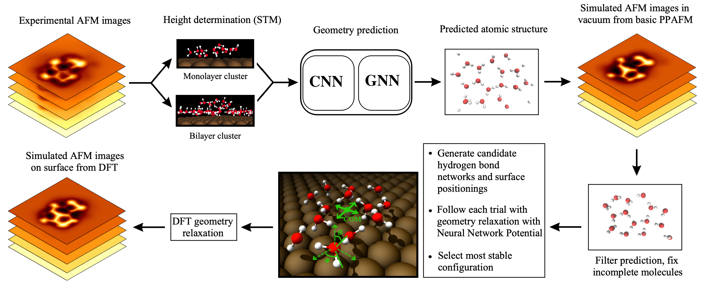

# Structure discovery in Atomic Force Microscopy imaging of ice

Paper: [_F. Priante et al., Structure Discovery in Atomic Force Microscopy Imaging of Ice, ACS Nano, 2024_](https://doi.org/10.1021/acsnano.3c10958)

Abstract: _The interaction of water with surfaces is crucially important in a wide range of natural and technological settings. In particular, at low temperatures, unveiling the atomistic structure of adsorbed water clusters would provide valuable data for understanding the ice nucleation process. Using high-resolution atomic force microscopy (AFM) and scanning tunneling microscopy, several studies have demonstrated the presence of water pentamers, hexamers, and heptamers (and of their combinations) on a variety of metallic surfaces, as well as the initial stages of 2D ice growth on an insulating surface. However, in all of these cases, the observed structures were completely flat, providing a relatively straightforward path to interpretation. Here, we present high-resolution AFM measurements of several water clusters on Au(111) and Cu(111), whose understanding presents significant challenges due to both their highly 3D configuration and their large size. For each of them, we use a combination of machine learning, atomistic modeling with neural network potentials, and statistical sampling to propose an underlying atomic structure, finally comparing its AFM simulated images to the experimental ones. These results provide insights into the early phases of ice formation, which is a ubiquitous phenomenon ranging from biology to astrophysics._

This folder contains the source code and links to the datasets that were used for training the machine learning models in the above paper.

## Scripts

The subdirectories contain various scripts for training and running predictions with the models:
- `training`: Scripts for training the atom position and graph construction models, and evaluating the trained models.
- `predictions`: Scripts for reproducing the results figures of the paper using the pretrained models.

## Data

This is a listing of the various data used in the paper. They will also be automatically downloaded when running the training or prediction scripts above.

Training datasets:
- Cu(111): https://doi.org/10.5281/zenodo.10047850
- Au(111), monolayer: https://doi.org/10.5281/zenodo.10049832
- Au(111), bilayer: https://doi.org/10.5281/zenodo.10049856

Experimental data: https://doi.org/10.5281/zenodo.10054847

Final relaxed geometries: https://doi.org/10.5281/zenodo.10362511

Pretrained weights for the models: https://doi.org/10.5281/zenodo.10054348

Training data and configuration files for training the Nequip neural network potentials:
- Cu(111): https://doi.org/10.5281/zenodo.10371802
- Au(111): https://doi.org/10.5281/zenodo.10371791
